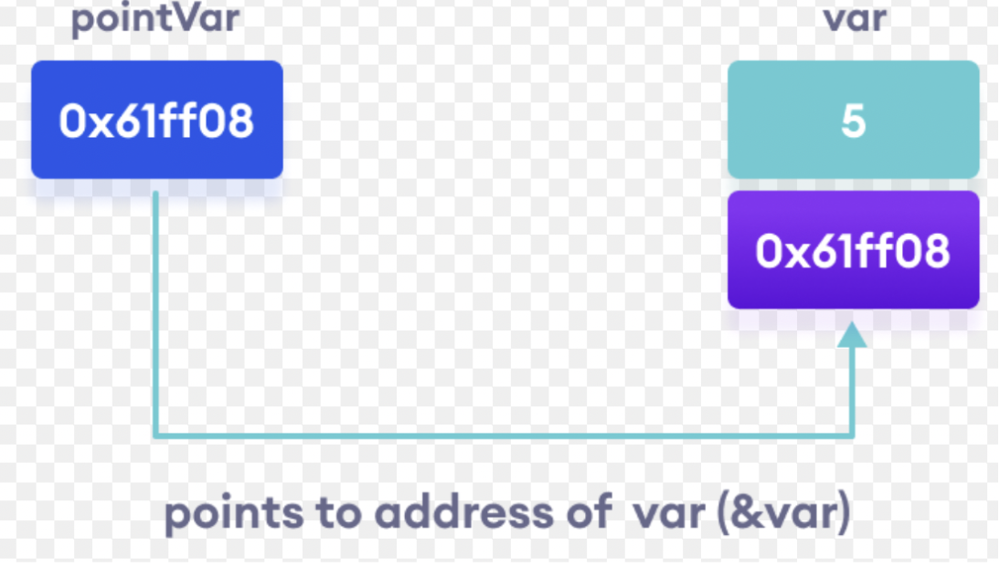
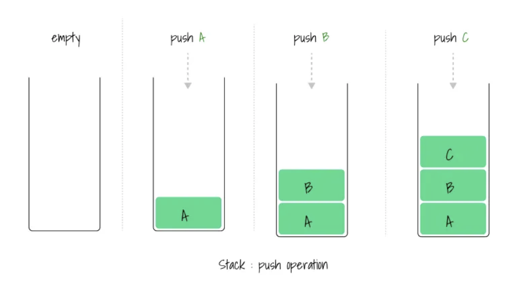
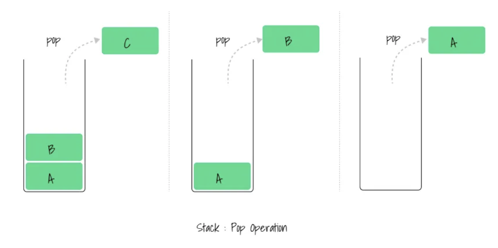
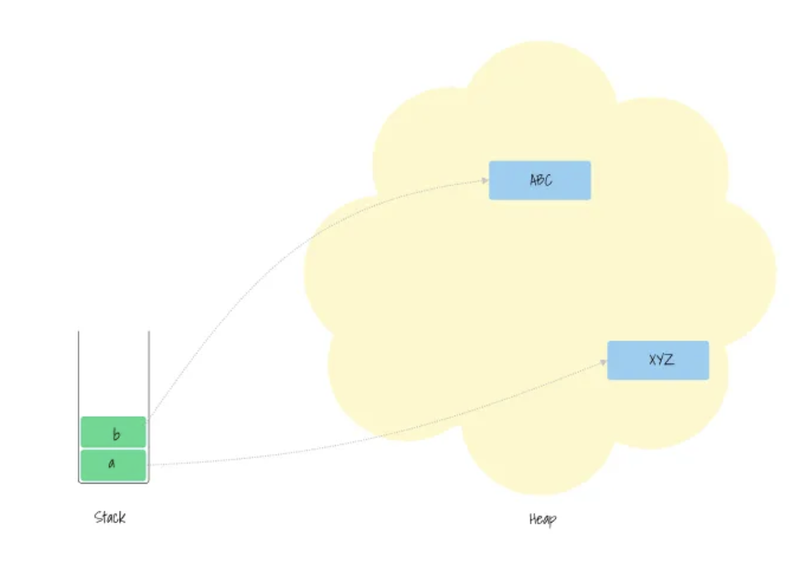

## Phân biệt Stack và Heap 

### Định nghĩa biến và con trỏ (pointer)

1.  Biến: Đại diện cho giá trị, lưu giá trị ở một vùng nhớ nào đó 
2. Con trỏ: cũng là giá trị nhưng giữ địa chỉ trỏ tới vùng nhớ mà giá trị được lưu 

Ví dụ minh hoạ:

### Stack

### Heap 

